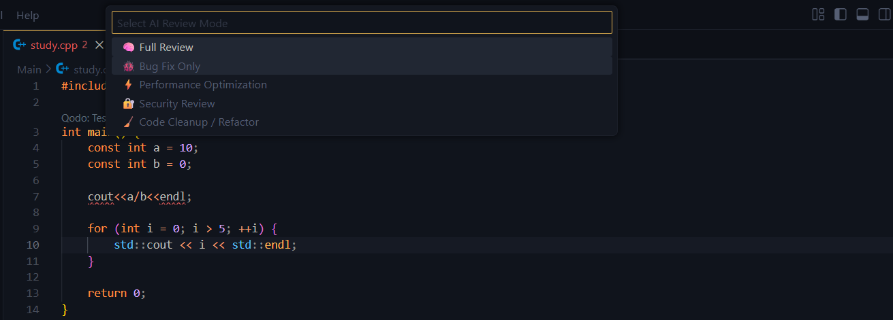
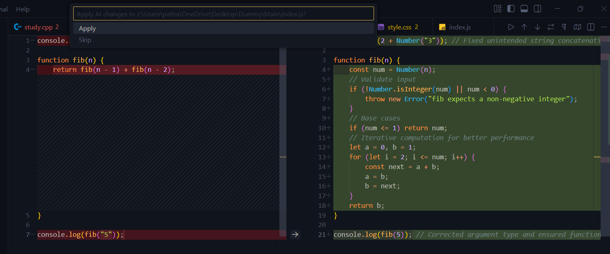
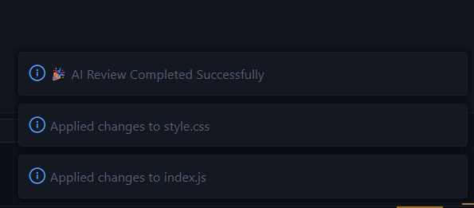
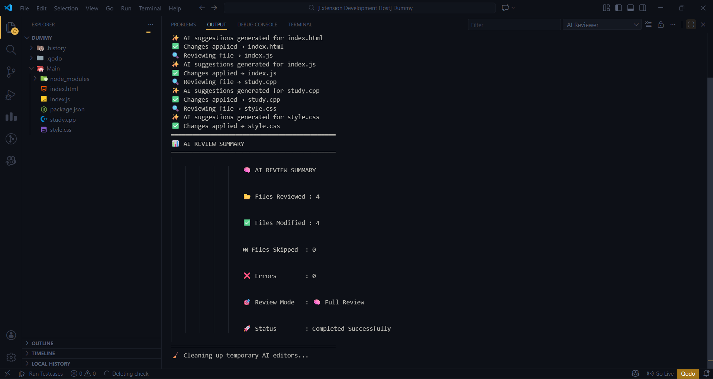

# 🤖 AI Code Reviewer – VS Code Extension

An **AI-powered VS Code extension** that reviews your codebase intelligently, detects bugs, improves performance, enhances security, and refactors code — **file by file with full diff preview and complete user control**.

## Features

- 📂 Review **entire folders or single files**
- 🧠 Multiple AI Review Modes:
  - Full Review
  - Bug Fix Only
  - Performance Optimization
  - Security Review
  - Code Cleanup / Refactor
- 🔍 **Side-by-side diff view** before applying changes
- ✅ Apply or Skip changes **per file**
- 📊 **Persistent review summary**
- 🔐 Secure API key storage using VS Code SecretStorage
- 🧱 Robust error handling (invalid key, rate limit, model errors)
- 📟 Live logs via Output Channel

## Screenshots

### Step 1: Select a folder or file

### Step 2: Enter API Key

### Step 3: Select Review Mode

### Step 4: Review the AI Generated Code

### Step 5: Apply or Skip AI Generated Code

### Step 6: View Status 

### Step 7: Check Complete Analysis

## Requirements

- Ollama API Key ([generate here](https://ollama.com/settings/keys))
- Internet connection

## Usage

1. Right-click a folder or file in VS Code Explorer
2. Select **AI Code Reviewer by Jagdish**
3. Enter your API key (stored securely in VS Code)
4. Wait for AI review to complete
5. Apply or skip changes per file

## Known Limitations

- Large files > 1MB may be skipped
- Some rate-limits may occur if API is heavily used

Build with Love by Jagdish - 😍