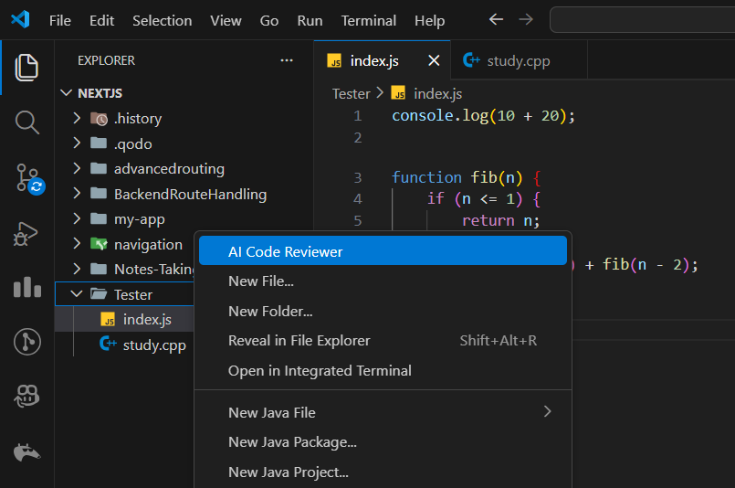
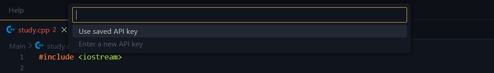
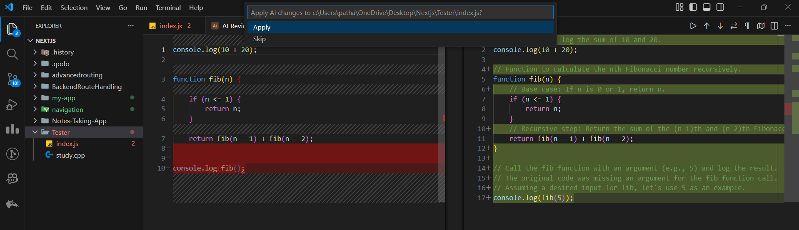

# AI Code Reviewer

Review and improve your code using Google Gemini AI directly in VS Code.

## Features

- Review all files in a folder
- Fix bugs, errors, logical and syntax issues
- Handles multiple languages: JS, TS, Python, C/C++, Java, HTML, CSS, JSON
- Shows diff of original vs AI-improved code
- Apply or skip changes per file
- Progress indicator + cancellation support
- Skips node_modules, build, dist, and large files automatically

## Screenshots

### Step 1: Select a folder

### Step 2: Enter API Key

### Step 3: Review & Apply Changes

## Requirements

- Google Gemini API Key ([generate here](https://aistudio.google.com/api-keys))
- Internet connection

## Usage

1. Right-click a folder in VS Code Explorer
2. Select **Review Folder with AI**
3. Enter your API key (stored securely in VS Code)
4. Wait for AI review to complete
5. Apply or skip changes per file

## Known Limitations

- Large files > 1MB may be skipped
- Some rate-limits may occur if API is heavily used

## Extension Settings

- Currently uses `gemini-2.5-flash-lite` model
- File extensions and skip folders are hard-coded (future updates may allow config)

Build with Love by Jagdish - 😍